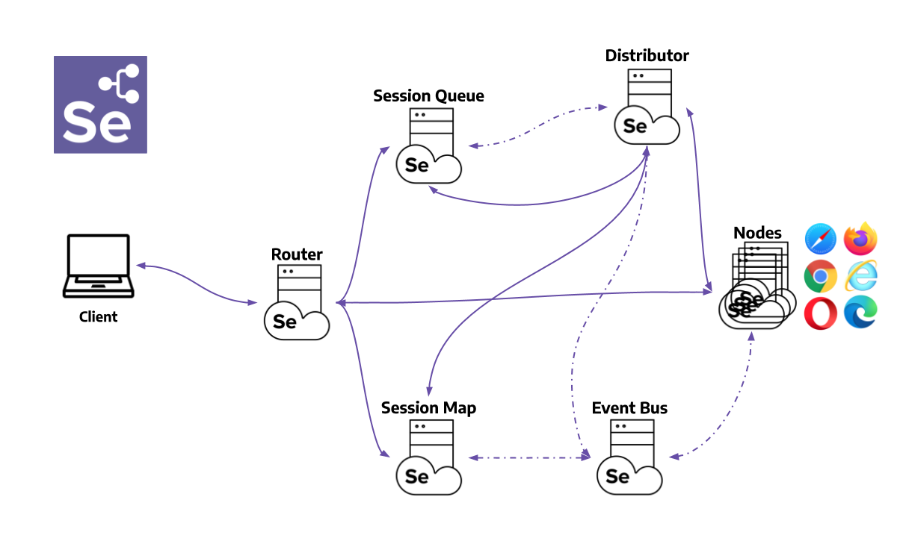

# selenium-grid-cloud-base-code
This is a base code, that we use to start Selenium grid and cloud course

If you are new to Selenium with Java and TestNG, I suggest looking at my courses, and learn how to build project like this here: https://practicetestautomation.com/courses/

## Selenium Grid components


## Running grid

Download selenium server(grid) from https://www.selenium.dev/downloads/
1. Start the `Event Bus` 
```bash
java -jar selenium-server-4.11.0.jar event-bus
```
2. Start the `Session Map`
```bash
java -jar selenium-server-4.11.0.jar sessions
```
3. Start the new `session queue`
```bash
java -jar selenium-server-4.11.0.jar sessionqueue
```
4. Start the `Distributor`
```bash
java -jar selenium-server-4.11.0.jar distributor --sessions http://localhost:5556 --sessionqueue http://localhost:5559 --bind-bus false 
```
5. Start the `Router`
```bash
java -jar selenium-server-4.11.0.jar router --sessions http://localhost:5556 --distributor http://localhost:5553 --sessionqueue http://localhost:5559
```
6. Add a `Node`
```bash
java -jar selenium-server-4.11.0.jar node --detect-drivers true
```